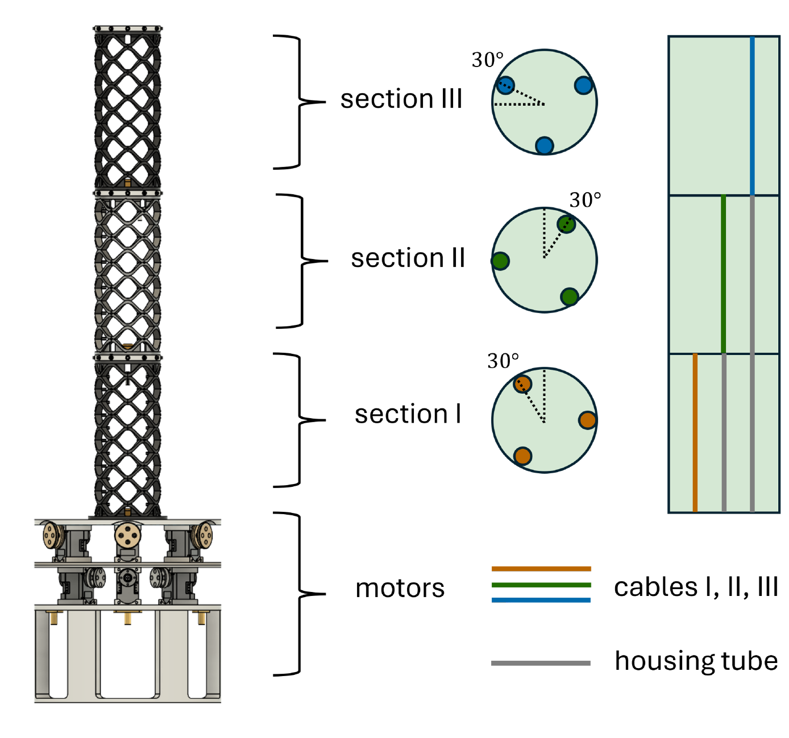

# Internal Camera-based Reconstruction and Closed-loop Control of Soft Robotic Arms

This repository contains the code accompanying the paper:
**Internal Camera-based Reconstruction and Closed-loop Control of Soft Robotic Arms** — L. Vignoli, G. Pei, F. Braghin, J. Hughes.

<p align="center">


</p>

We propose a vision-based framework for distributed state estimation and closed-loop control of tendon-driven soft robotic arms. Miniature cameras embedded in each section provide dense proprioceptive feedback. CNNs map multi-view images to both tip pose and full-body curvature (constant, affine, quadratic). We evaluate two controllers — a model-based null-space velocity controller built on the Piecewise Constant Curvature (PCC) model, and a data-driven inverse kinematics network with explicit secondary-objective optimization — on single- and multi-section manipulators, in open- and closed-loop, with and without external disturbances.

---

## Robot

The arm is a continuum manipulator whose shape is determined by cable-tendon actuation applied to a Trimmed Helicoid (TH) structure. Each section is parameterised by curvature coordinates `q = [Dx, Dy, Dl]`, where `Dx` and `Dy` are lateral deflections and `Dl` is the length extension. Tendon-length changes ΔDELTAL [mm] are converted to Dynamixel encoder ticks by `unit_scale = 4096 / (π · D_pulley)`.

Two hardware configurations are implemented:

| | SINGLE | MULTI |
|---|--------|-------|
| Sections | 1 | 3 |
| Motors | 3 (IDs 1–3) | 9 (IDs 11–19) |
| Cameras | 1 USB | 3 USB (threaded) |
| Actuation DoF | 3 | 9 |
| Tip pose DoF | 6 | 6 |

---

## Control

Both configurations support two Jacobian-based control strategies:

**Analytic Jacobian** — symbolic Jacobians (`q2tendon`, `q2coordinates`, `q2xyz`) derived with SymPy from the PCC model, evaluated numerically via iterative Jacobian integration.

**Data-driven Jacobian** — Jacobian computed on-the-fly via `torch.autograd.functional.jacobian` applied to learned FK/IK neural networks.

The MULTI configuration is kinematically redundant (9 actuators, 6-DoF tip pose). A null-space controller exploits this redundancy to simultaneously track the tip target and drive the motor configuration toward a nominal posture:

```
dDELTAL = J_pseudo @ delta_pose + N @ (DELTAL_mean - DELTAL_current)
```

---

## Sensing & Reconstruction

**Tip pose** is estimated by a CNN that maps a grayscale camera frame to end-effector position and orientation (`helyx_model.pt`). For the MULTI configuration, three cameras observe the three sections independently and the three views are stacked as channels of a single input tensor.

**Shape reconstruction** fits polynomial curvature models — constant, affine, or quadratic — to rotation matrices derived from OptiTrack backbone markers, via CasADi/IPOPT optimisation. An ANN-based reconstruction path is also available, using section-specific TorchScript models inferred from relative inter-section transforms.

---

## Repository Structure

```
VisionSoftControl/
│
├── SINGLE/
│   ├── SINGLE_jacobians.py              # Symbolic Jacobians: q → tendon, q → pose
│   ├── SINGLE_kinematics.py             # Iterative mappings: tendon ↔ curvature ↔ pose
│   ├── SINGLE_reconstruction_utility.py # Curvature reconstruction (CasADi/IPOPT)
│   ├── SINGLE_controller.py             # SINGLEController (closed-loop), SINGLEOpenLoop
│   ├── SINGLE_data_acquire.py           # Random motor sampling + mocap/camera capture
│   ├── SINGLE_control_test.py           # Polygon tracking and workspace sampling
│   ├── SINGLE_plot_polygon.py           # Polygon waypoint visualisation
│   ├── SINGLE_try_motion.py             # Random workspace exploration
│   ├── SINGLE_helyx_training.ipynb      # Model training
│   ├── SINGLE_helyx_testing.ipynb       # Model evaluation
│   └── SINGLE_control_results.ipynb     # Control result analysis
│
└── MULTI/
    ├── MULTI_jacobians.py               # Symbolic Jacobians: q → tendon, q → pose, q → xyz
    ├── MULTI_kinematics.py              # Iterative mappings: tendon ↔ xyz ↔ curvature
    ├── MULTI_reconstruction_utility.py  # Curvature reconstruction (analytical + ANN)
    ├── MULTI_cameras_utility.py         # ThreadedCameraSystem for 3 concurrent cameras
    ├── MULTI_controller.py              # MULTIController, MULTIOpenLoop, NullSpaceCheck
    ├── MULTI_data_acquire.py            # Concurrent acquisition: cameras + mocap + curvature
    ├── MULTI_control_test.py            # Evaluation suite (9 test modalities)
    ├── MULTI_curvature_checks.py        # ANN vs. analytical curvature validation
    ├── MULTI_FK_acquire.py              # Forward kinematics dataset collection
    ├── MULTI_try_motion.py              # Random and Jacobian-guided motion exploration
    ├── MULTI_helyx_training.ipynb       # Model training
    ├── MULTI_helyx_testing.ipynb        # Model evaluation
    └── MULTI_control_results.ipynb      # Control result analysis
```

### Pre-trained models

| File | Description |
|------|-------------|
| `helyx_model.pt` | CNN: grayscale image(s) → tip pose (`f_p^1` or `f_p^3`) |
| `FK_model.pt` | Forward kinematics MLP: ΔDELTAL → tip pose (MULTI) |
| `IK_model.pt` | Inverse kinematics MLP with null-space regularization: tip pose → ΔDELTAL (MULTI) |
| `constant_model.pt` / `affine_model.pt` / `quadratic_model.pt` | Polynomial curvature regressors |
| `*_for_MULTI_model.pt` | Section-specific curvature models used for MULTI reconstruction |
| `DELTAL_stats.pt` | Normalisation statistics for the MULTI null-space objective |

Recorded control results and workspace samples are stored as `.npz` archives alongside the source files. Raw training datasets are available from the corresponding author on reasonable request.

---

## Setup

### Hardware

| Component | Specification |
|-----------|---------------|
| Actuators | DYNAMIXEL XL330-M288-T, Protocol 2.0, 57600 baud, `/dev/ttyUSB0` |
| Pulley diameter | 6 mm |
| SINGLE motors | IDs 1–3, tendon angles 0°, 120°, −120° |
| MULTI motors | IDs 11–19 (three groups of three; sections II–III routed via Bowden cables) |
| Cameras | USB grayscale, 480 × 640 (OpenCV V4L2 backend) |
| Motion capture | OptiTrack Prime 13 ×6, via ROS `geometry_msgs/PoseStamped` topics |

The robot base frame and the OptiTrack world frame are related by a fixed correction `R_corr = [[1,0,0],[0,0,-1],[0,1,0]]`. All lengths are in millimetres; angles in radians.

### Dependencies

```
numpy
torch >= 2.0
torchvision
opencv-python
scipy
sympy
casadi
scikit-learn
dynamixel-sdk
rospy        # ROS Noetic
plotly
matplotlib
```

ROS Noetic must be sourced and `rospy` importable. OptiTrack data is consumed from live ROS topics. Before each session:

```bash
roslaunch optitrack_ros_communication optitrack_nodes.launch
v4l2-ctl --list-devices
```

---

## Usage

All scripts are run from within the respective `SINGLE/` or `MULTI/` subdirectory. Motor calibration runs interactively at startup (`w`/`s`/`h` keys, adaptive acceleration). Camera-to-section assignment in the MULTI configuration is also interactive.

### Data collection

```bash
# SINGLE: random ΔDELTAL sampling with camera and mocap recording (10,000 samples)
python SINGLE_data_acquire.py

# MULTI: concurrent camera + mocap acquisition with per-batch confirmation
python MULTI_data_acquire.py

# MULTI: forward kinematics dataset (ΔDELTAL → tip pose) for IK training
python MULTI_FK_acquire.py
```

### Model training and evaluation

```bash
# SINGLE
jupyter notebook SINGLE_helyx_training.ipynb
jupyter notebook SINGLE_helyx_testing.ipynb

# MULTI
jupyter notebook MULTI_helyx_training.ipynb
jupyter notebook MULTI_helyx_testing.ipynb
```

### Control evaluation

```bash
# SINGLE: closed-loop and open-loop polygon tracking / workspace sampling
python SINGLE_control_test.py
jupyter notebook SINGLE_control_results.ipynb

# MULTI: interactive suite — closed/open-loop × data-driven/Jacobian × null-space check
python MULTI_control_test.py
jupyter notebook MULTI_control_results.ipynb

# MULTI: curvature validation (analytical reconstruction vs. ANN prediction)
python MULTI_curvature_checks.py
```

The 50 g payload experiment is run by setting `WEIGHT = True` (and the appropriate `w_string`) at the top of [`MULTI_control_test.py`](MULTI/MULTI_control_test.py) and re-running the corresponding workspace and polygon modalities.

### Utilities

```bash
# Random workspace exploration (debugging and demos)
python SINGLE_try_motion.py
python MULTI_try_motion.py
```

---

## Citation

If you use this code, please cite:

```bibtex
@article{vignoli2026vision,
  author  = {Vignoli, Lorenzo and Pei, Guanran and Braghin, Francesco and Hughes, Josie},
  title   = {Internal Camera-based Reconstruction and Closed-loop Control of Soft Robotic Arms},
  year    = {2026}
}
```

---

## License

MIT — see [LICENSE](LICENSE).
